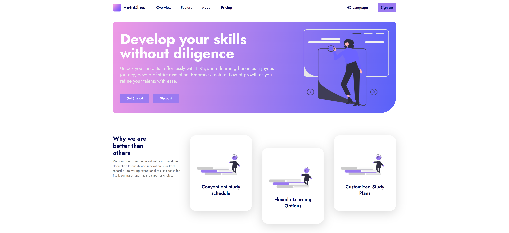

# VirtuClass

This repository is a React-based e-commerce website UI project, utilizing Tailwind CSS for styling. It aims to provide a clean, modern, and responsive user interface for browsing and purchasing clothing items online. The project focuses on leveraging React's component-based architecture and Tailwind's utility-first approach to streamline development and enhance user experience.

## Demo

LIVE: [VirtuClass](https://hrs-virtu-class.netlify.app/)

## Screenshot

## Tech Stack

Yarn Vite React Tailwind

## Author

### Hubert Śleszyński

Portfolio: https://hrs-dev.netlify.app/

Linkedin: https://www.linkedin.com/in/hubertsleszynski/

Github: https://github.com/HubertSleszynski
